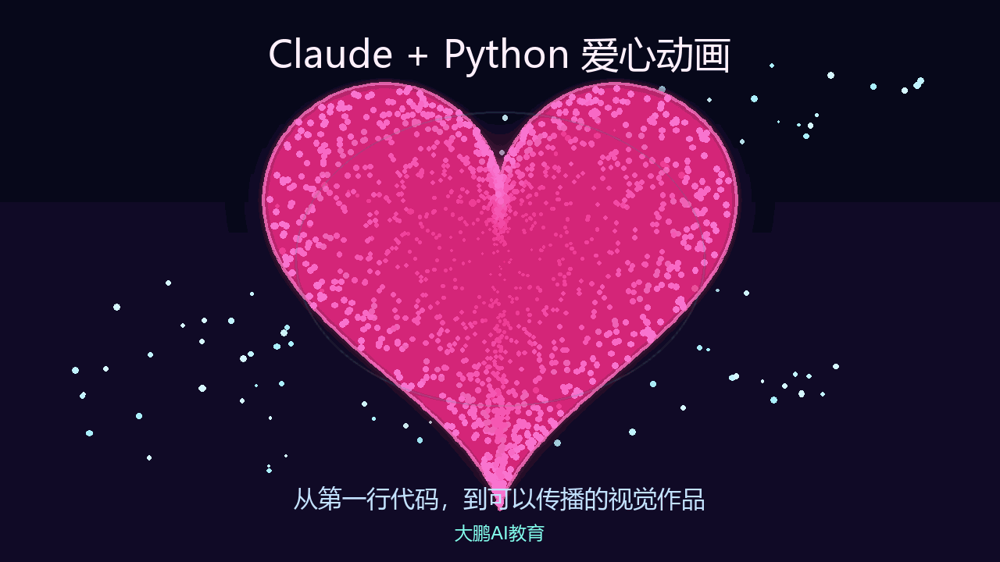
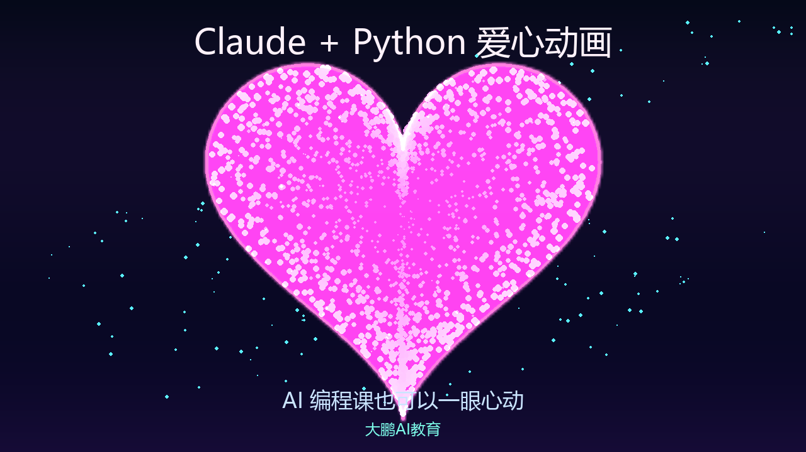

# DaPengAiCourse

大鹏 AI 课程配套开源代码仓库。

这个仓库用于存放「大鹏 AI 教育」体系课中的实战案例代码，所有代码开源免费，方便学员复现课程效果，也方便对 AI 编程、Python 入门、自动化工具和真实项目落地感兴趣的同学参考学习。

## 课程入口

- 51CTO 录播课程：[大鹏 AI 教育讲师主页](https://edu.51cto.com/lecturer/12795695.html)
- B 站录播课程：[大鹏 AI 教育 B 站空间](https://space.bilibili.com/384418921/pugv)

## 当前内容

### 001 大鹏玩转 Claude Python 零基础入门

目录：

```text
c001_claude_python_heart/
└── prepare/
    ├── c006_check_python.py
    ├── c007_vscode_smoke_test.py
    ├── c011_hello.py
    ├── c012_heart_turtle_basic.py
    ├── c012_heart_turtle_claude_upgrade.py
    ├── c012_heart_pillow_promo.py
    ├── c012_heart_pillow_cinematic.py
    ├── c012_heart_tkinter_neon.py
    ├── c012_heart_pygame_neon.py
    └── outputs/
```

这门课从零基础开始，带你完成：

- 安装 Python 解释器；
- 搭建 VS Code Python 开发环境；
- 使用 Claude Code 辅助写代码；
- 使用 CC Switch 配置 Claude 模型；
- 安装 Claude Desktop 桌面版；
- 写出第一个 Python 程序；
- 用 turtle、Pillow、Tkinter、Pygame 做出 Python 爱心动画。

## 效果预览

Pillow 电影感版本：



Pygame 霓虹粒子版本：



## 快速运行

建议使用 Python 3.10 或更高版本。

```bash
git clone https://github.com/DaPengRuYi/DaPengAiCourse.git
cd DaPengAiCourse
python -m pip install -r requirements.txt
```

运行第一个 Python 程序：

```bash
python c001_claude_python_heart/prepare/c011_hello.py
```

运行 Pillow 宣传图版本：

```bash
python c001_claude_python_heart/prepare/c012_heart_pillow_cinematic.py
```

运行 Pygame 实时动画版本：

```bash
python c001_claude_python_heart/prepare/c012_heart_pygame_neon.py
```

## 适合谁学习

- Python 零基础学员；
- 想用 AI 辅助写代码的新手；
- 想从课程案例里学习 AI 编程工作流的同学；
- 想把学习、工作、创业里的想法做成真实应用的人。

## 开源说明

本仓库代码采用 MIT License 开源，可以免费学习、运行、修改和二次开发。

课程视频、讲义、品牌素材和商业培训内容不等同于本仓库代码授权，转载或商业使用前请联系确认。

## 商务合作

我可以提供：

- 一对一 AI 私教；
- 企业 AI 培训；
- 线下课和内部直播课；
- AI 应用开发、自动化脚本、网站、小程序、后台系统等外包项目；
- UI 设计方案，可以先免费出 UI 设计，满意后再付款合作。

联系方式：

- 微信：`yggaibc`
- 邮箱：`lxgzhw@163.com`

## 关于大鹏 AI 教育

我是张大鹏，关注大鹏 AI 教育。

在 AI 时代，我们一起学习并掌握 AI 技术和相关工具，从零到一搞清楚 AI 的底层实现细节和运行原理，做到知其然更知其所以然，把学习、工作、创业里的想法做成能落地的真实应用。
